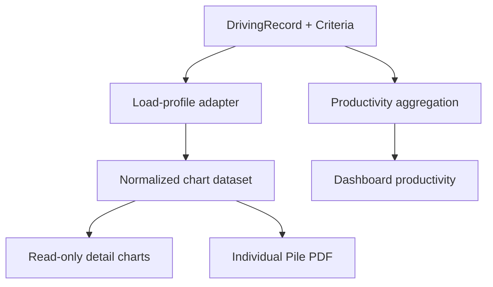

# Pile Driving Load Profile and Project Information Design

- Date: 2026-09-06
- Repository: `chaiyapreyk/piletech-pro`
- Branch: `codex/driving-load-chart-spec`
- Status: User-approved design; implementation not started
- Scope: Current release features plus a non-implementation roadmap for drawing-based pile status

## 1. Objectives

This change shall:

1. Allow users to edit existing project information.
2. Calculate an estimated ultimate resistance profile from each recorded Blow/ft interval using the existing Hiley calculation engine and the pile's assigned Driving Criteria.
3. Display working-load reference lines for FS 2.5, 3.0, 3.5, and 4.0.
4. Show the pile tip level and relevant elevations on the chart.
5. Make the chart available from a read-only "View Data" action without opening the driving-record editor.
6. Include the full chart in the Individual Pile PDF report.
7. Capture the actual pile-driving date and summarize actual productivity and cumulative progress.
8. Preserve drawing upload, pile placement, and drawing status reporting as a future phase.

## 2. Scope Boundaries

### Included

- Editing Project name, code, location, client, consultant, and contractor.
- Read-only pile detail modal/sheet opened from pile lists and dashboard grids.
- Synchronized Blow Count and Estimated Ultimate Load charts.
- FS reference lines and elevation markers.
- Individual Pile PDF chart output.
- Editable actual driving date with safe preservation on later record edits.
- Actual productivity dashboard with daily pile count, daily driven length, rolling average, peak day, and cumulative progress.
- Calculation, API, component, and report tests.

### Excluded

- Uploading drawings.
- Calibrating a drawing scale or coordinate system.
- Placing piles on drawings.
- Drawing status overlays and drawing reports.
- Replacing PDA/CAPWAP or static load testing.
- Adding a new independent bearing-capacity formula.
- Planned-versus-actual baselines, target piles per day, earned-value metrics, or ahead/behind schedule status.

## 3. Chosen Approach

Use two synchronized charts sharing the same vertical elevation axis:

1. **Blow Count Profile** — Blow/ft or Blow/m against elevation.
2. **Estimated Ultimate Load Profile** — Hiley estimated ultimate resistance in tonnes against elevation.

This is preferred over combining unlike units on one axis. Hovering or selecting an interval in either chart highlights the same elevation interval in both charts. The report places the charts side by side when page width permits and stacks them when necessary.

## 4. Engineering Calculation

### 4.1 Penetration Set

For a FEET record with `N` blows in a one-foot interval:

```
setCmPerBlow = 30.48 / N
```

For a METER record with `N` blows in a one-metre interval:

```
setCmPerBlow = 100 / N
```

Only finite values where `N > 0` are calculated. A skipped or missing interval remains a gap; the chart must not interpolate through it.

### 4.2 Hiley Estimated Ultimate Resistance

Each valid interval shall call a new pure adapter around the existing Hiley engine. The adapter must reuse the same units, efficiency logic, validation, and Hiley equation used by the calculator. It must not duplicate the equation inside a React component.

Inputs come from the pile's assigned `DrivingCriteria`:

- hammer weight
- drop height
- pile weight
- cushion coefficient
- hammer efficiency
- temporary compression
- pile properties already required by the current Hiley engine

Temporary compression uses this precedence:

1. `DrivingRecord.measuredTempCCm` when present and valid.
2. `DrivingCriteria.tempCompressionC` otherwise.

The result is named `estimatedUltimateLoadT`. It is an indicative dynamic-formula estimate during driving, not a verified static capacity.

### 4.3 FS Reference Lines

For the assigned criteria's required safe working load:

```
requiredUltimateLoadT = safeWorkingLoadT * safetyFactor
```

The chart shall show vertical reference lines for:

- FS 2.5
- FS 3.0
- FS 3.5
- FS 4.0

Every line label includes both FS and calculated tonnes, for example `FS 3.0 · 105 t`. These reference lines are comparisons only and do not overwrite the project's configured safety factor or change the stored pass/fail status.

### 4.4 Elevation Mapping

For interval index `i` beginning at zero:

- FEET: cumulative penetration at the interval end is `(i + 1) * 0.3048 m`.
- METER: cumulative penetration at the interval end is `(i + 1) * 1.0 m`.
- Elevation is `groundLevelM - cumulativePenetrationM`.

Markers:

- Ground level: use `groundLevelM` when available.
- Cut-off level: use `cutOffLevelM` when available.
- Tip level: use `tipLevelM` when available.
- Derived tip: when `tipLevelM` is absent and both ground level and driven length exist, use `groundLevelM - drivenLengthM` and label it `Calculated tip`.

The UI must distinguish stored and derived tip levels.

### 4.5 Missing Inputs

If no Driving Criteria is assigned, or required Hiley inputs are invalid:

- Keep the Blow Count chart available.
- Replace the load chart with a clear unavailable state.
- List the missing inputs.
- Provide an authorized navigation action to assign or edit criteria.
- Do not display zero-load points or silently substitute engineering defaults.

## 5. User Interface

### 5.1 Project Information

Add `Edit Project Information` to the current project switcher/menu. The form edits:

- Project name
- Project code
- Location
- Client
- Consultant
- Contractor

Project code remains required and unique. The API returns inline validation errors and does not partially update the record. Driving Criteria fields remain outside this form.

### 5.2 Read-only Pile Detail

Add a `View Data` action to relevant pile rows/cards. It opens:

- A wide modal on desktop/tablet.
- A full-screen sheet on mobile.

The view contains:

- pile and project summary
- driving status and final-set result
- elevation summary
- Blow Count Profile
- Estimated Ultimate Load Profile with FS lines
- calculation-input summary
- actions for Edit, Print, and Export PDF

Opening this view must not put fields into edit mode or allow accidental data mutation.

### 5.3 Chart Behavior

- Elevation increases upward; deeper values appear lower.
- Tooltips show interval, elevation, recorded blows, set per blow, estimated ultimate load, and input source for compression.
- FS lines use stable, accessible colors and text labels; meaning must not depend on color alone.
- Tip and cut-off markers remain visible even if outside the recorded interval range by extending the displayed elevation domain.
- Charts handle mobile width without horizontal page overflow.
- Print rendering uses a white background and deterministic dimensions.

### 5.4 Actual Driving Date

The driving-record form shall include an editable `Actual Driving Date` field:

- A new record defaults to the user's current calendar date.
- Saving an existing record preserves the stored date unless the user explicitly changes it.
- The API must stop overwriting `Pile.driveDate` with `new Date()` on every save.
- The client sends a date-only value in `YYYY-MM-DD` form.
- The API validates it as a real date that is not in the future, then stores it with date-only UTC semantics to avoid time-of-day grouping errors.
- The date appears in pile tables, read-only View Data, Individual Pile PDF, and productivity summaries.
- Existing driven records without a valid date appear in a data-quality count named `Missing driving date` and are excluded from date-based charts until corrected.

A pile counts as driven productivity when it has a saved `DrivingRecord` and a valid `driveDate`. Both `COMPLETED` and `ISSUE` piles count as work performed; pass/fail remains a separate quality measure.

### 5.5 Actual Productivity and Cumulative Progress

Add a Productivity panel to the project dashboard with filters for Last 7 days, Last 14 days, Last 30 days, custom date range, Building, and pile criteria/type.

KPI cards show piles driven in the selected period, total driven length, average piles per calendar day, seven-calendar-day rolling average including zero-production days, peak production date/count, overall cumulative progress, and missing driving date count.

The chart uses daily bars for `Piles driven per day`, a toggle for `Driven length per day (m)`, and a cumulative driven-pile percentage line. Calendar dates with zero production remain visible. It uses actual records only and does not show planned, ahead, or behind status.

Definitions:

```
dailyPileCount = count(saved DrivingRecord with valid driveDate on date)
dailyDrivenLengthM = sum(drivenLengthM for those records)
cumulativeProgressPercent = cumulativeDrivenPileCount / totalProjectPileCount * 100
averagePilesPerCalendarDay = selectedPeriodPileCount / selectedCalendarDayCount
rolling7DayAverage = sum(dailyPileCount for current day and prior 6 calendar days) / 7
```

A pile contributes once using its current actual driving date. Editing the date moves that pile between daily buckets without changing the overall driven total.

## 6. Reporting

The Individual Pile PDF includes:

1. Project and pile identification.
2. Assigned Driving Criteria and the Hiley inputs used.
3. Driving summary and final-set result.
4. Blow Count and Estimated Ultimate Load charts.
5. FS 2.5, 3.0, 3.5, and 4.0 reference values.
6. Ground, cut-off, and pile tip levels.
7. A generated-at timestamp.
8. This notice:

> Estimated ultimate load is calculated from driving records using a dynamic formula. It is not a substitute for project-required PDA/CAPWAP analysis or static load testing.

Daily Summary PDF remains tabular in this release to avoid uncontrolled report length.

Chart export must use a report-safe SVG or high-resolution image generated from the same normalized chart dataset used by the UI. The report must not recalculate engineering values independently.

## 7. Architecture and Data Flow



Recommended units:

- `src/lib/calculations/drivingLoadProfile.ts`: pure normalization and load-profile calculation.
- `src/components/driving/PileLoadProfileChart.tsx`: chart presentation only.
- A read-only pile detail component under `src/components/piles/`.
- Existing project API and project switcher for project-information editing.
- A pure productivity aggregation module under `src/lib/calculations/` consumed by the dashboard.
- Existing pile and driving APIs updated to return and preserve `driveDate`.
- Existing PDF generator/exporter for the report integration.

React components must not contain authoritative engineering formulas. UI and PDF must consume the same normalized dataset.

## 8. Error Handling and Auditability

- Validation errors identify the exact missing or invalid field.
- Calculation failures affect only the load chart; the rest of the detail view remains usable.
- The chart displays the calculation method and source criteria name.
- Report generation fails with a user-readable error if the chart cannot be rendered; it must not silently omit a requested chart.
- No existing driving record is rewritten by viewing or exporting.
- Editing project information updates `updatedAt` through Prisma's existing behavior.

## 9. Testing and Acceptance Criteria

### Calculation tests

- FEET conversion: 30 Blow/ft produces 1.016 cm/blow.
- METER conversion: 30 Blow/m produces 3.333333... cm/blow.
- Valid intervals reproduce the existing Hiley engine result for identical inputs.
- FS lines equal `safeWorkingLoadT * [2.5, 3.0, 3.5, 4.0]`.
- Null, skipped, zero, negative, NaN, and malformed blow data do not create load points.
- Measured compression overrides criteria compression only when valid.
- Elevation and derived tip calculations are correct.
- Daily count, driven-length sum, cumulative percentage, calendar-day average, and rolling seven-day average match fixed date fixtures.
- COMPLETED and ISSUE records with valid dates count once; PLANNED records and records without driving data do not count.

### UI tests

- View Data opens without entering edit mode.
- Both charts share interval/elevation selection.
- Missing criteria shows an unavailable state and no false zero value.
- Tip, cut-off, and ground markers render when available.
- Stored and calculated tip labels are different.
- Project information validates required and unique code values.
- New records default the driving date; existing records preserve it unless explicitly changed.
- Productivity filters return correct values and include zero-production calendar days.
- Missing driving dates are identified without being placed in an incorrect daily bucket.
- Mobile view does not overflow horizontally.

### Report tests

- Individual PDF contains both charts, FS labels, elevations, inputs, and notice.
- UI and PDF use the same normalized dataset.
- Skipped intervals remain gaps.
- Report generation exposes chart-rendering failures.
- Existing Daily Summary behavior is unchanged.

### Release acceptance

- Existing calculation and database tests pass.
- New calculation and component tests pass.
- Production build succeeds.
- Read-only detail and PDF are visually verified using at least one FEET record, one METER record, one skipped interval, and one missing-criteria pile.
- Productivity is verified across at least ten calendar days containing production, zero-production days, an ISSUE pile, and an edited driving date.
- No schema migration is required for the current release because `Pile.driveDate` already exists.

## 10. Engineering Use Limitation

FHWA references distinguish driving observations and dynamic analysis from static load tests used to confirm design assumptions. Therefore, every load chart and generated report must retain the word `Estimated` and the limitation notice. Reference:

- FHWA, Design and Construction of Driven Pile Foundations, Volume I: https://www.fhwa.dot.gov/engineering/geotech/pubs/gec12/nhi16009_v1.pdf
- FHWA, Dynamic and Static Pile Load Test Data: https://www.fhwa.dot.gov/publications/research/infrastructure/geotechnical/05159/chapter4.cfm

## 11. Future Drawing Phase

A future, separately approved design may add:

- PDF/JPG/PNG drawing upload and versioning
- scale calibration and drawing coordinates
- pile placement and numbering on plan
- links between drawing markers and `Pile.id`
- status colors for Planned, Driving, Completed, and Issue
- drawing-based progress and exception reports

That phase will require new storage, database entities, drawing-version rules, coordinate transformation, and report behavior. None of those changes are part of this implementation.
